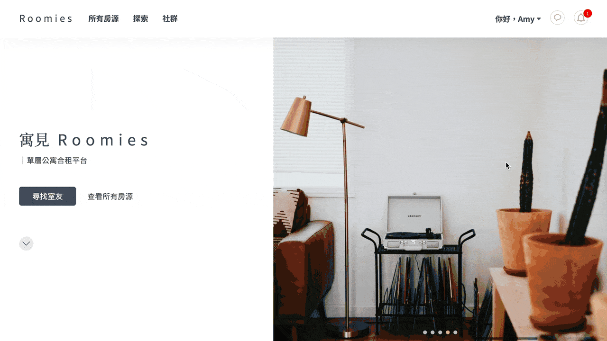
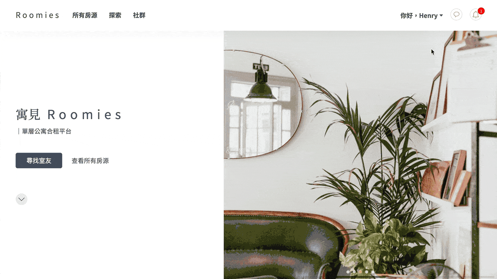

# Roomies

> **Roomies is an online co-rent platform with social networking**. Designed for landlords to manage their apartment properties and for renters to easily find apartments and roommates!\
> [View Website >>](https://roomies-f03cd.web.app/)

## Main Features

- Built SPA based on React / React Router
- Created notification system and chat room with Firebase Firestore Database
- Fulfilled complex filter with useReducer
- Implemented place searching feature with Google Maps API
- Established shared components system to enhance development efficiency

## Demo

- ### **Landing Page**

  > Welcome to Roomies! Start your journey from sign up / login, or feel free to look around as a visiter.

  

- ### **Apartments Page**

  > Find the ideal apartment by filtering or searching by keywords.

  

- ### **Join Rental Group**

  > Join apartment rental group after signed in and filled out required info of user profile.

  

- ### **Rental Group Page**

  > Connect with members in the group, or invite other users to join the group! Create interactions through posts and messages.

  

- ### **Create Co-rent Team**

  > Manage team member list and invite other members in the group to join the team.

  

- ### **Schedule Property Viewing Event**

  > When the rental team's joined members count is equal to the roomies count of the apartment, the host of the team can schedule a property viewing event to the landlord!

  

- ### **Confirm The Property Viewing Request Sent By Renters**

  > The landlord will receive a notification after the host sent the property viewing request, and can manage schedules in profile page.

  

- ### **Successfully Arranged The Pre-process of Renting!**

  > Now the renters can view the apartment property with the landlord on scheduled time and continue the process of renting the apartment afterwards.

  

[Explore more >>](https://roomies-f03cd.web.app/)

## Techniques

### Front-End Fundamental

- HTML
- CSS
- JavaScript
- RWD

### Libraries

- React
- React Router
- Styled Components

### Cloud Services

- Firebase
  - Firestore database
  - Storage
  - Auth
  - Hosting

### APIs

- Google Maps API

### Packages

- [react-google-maps/api](https://github.com/JustFly1984/react-google-maps-api)
- [react-loading-skeleton](https://github.com/dvtng/react-loading-skeleton)
- [react-firebase-hooks](https://github.com/csfrequency/react-firebase-hooks)
- [react-avatar-editor](https://github.com/mosch/react-avatar-editor)
- [mui/x-date-pickers](https://github.com/mui/mui-x)
- [react-linkify](https://github.com/tasti/react-linkify)
- [react-select](https://github.com/JedWatson/react-select)
- [fullcalendar](https://github.com/fullcalendar/fullcalendar)
- [swiper](https://github.com/nolimits4web/swiper)
- [uuid](https://github.com/uuidjs/uuid)

### Flow Chart

## Future Features

- Use guide for both renters and landlords
- Online tool for renters to manage and split monthly utility fees
- Rating system for users to filter unreliable renters / landlords
- Living conventions for renters to co-edit (which can be downloaded as PDF files)
- Advertisement services providing for landlords to let their apartment properties stand out from others
- Other apartment rental services (e.g., filming) to give landlords more flexibility with their properties

## Contact

Feel free to contact me if you have any questions :) \
E-mail: michelleshen0828@gmail.com
